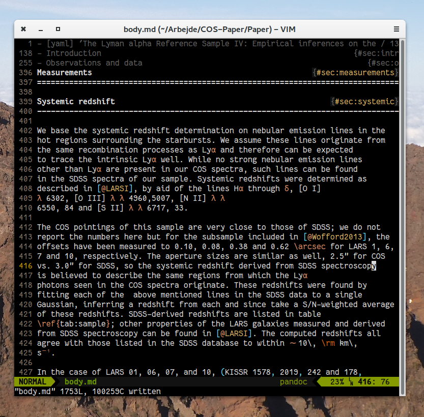
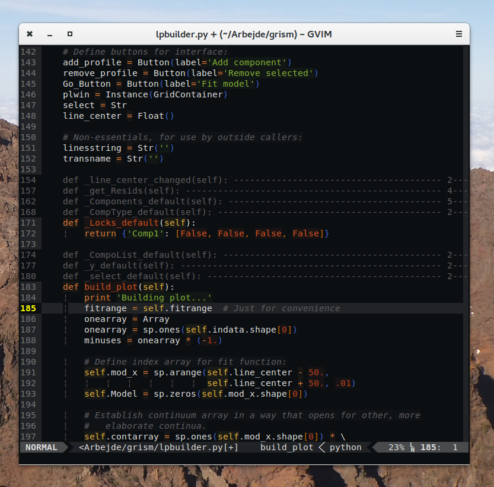

# Twilight-anti-bright colorscheme for Vim

Light-on-dark colorscheme for \*Vim, created as an Emacs and TextMate theme by
[jimeh][3], which is in turn inspired by the twilight-bright TextMate
theme created by [Florian Pichler][1] (a Vim version of that theme is
[here](https://github.com/thriveth/vim-twilight-bright)). 

The theme is converted from the TextMate version using [Coloration][2]. I have
not made any attempts to modify it - I might later, might not. I like it pretty
well as it is straight out of Coloration.

## Screenshots

*Everybody loves screenshots!*   

Running in the console, editing a Markdown file.

Running in the console, editing a Python file:

Gvim, editing Python file:

## Install

### Manually

Just move/copy the file in the `colors` folder to your `.vim/colors` folder,
and from Vim run `:colorscheme twilight-bright`.

### Using Vundle

Add the line

    Plugin 'thriveth/vim-twilight-bright'

to your `.vimrc`, run `PluginInstall`, and you should be good to go.

[1]: http://einserver.de/goodies
[2]: http://coloration.ku1ik.com/
[3]: https://github.com/jimeh/twilight-anti-bright-theme
